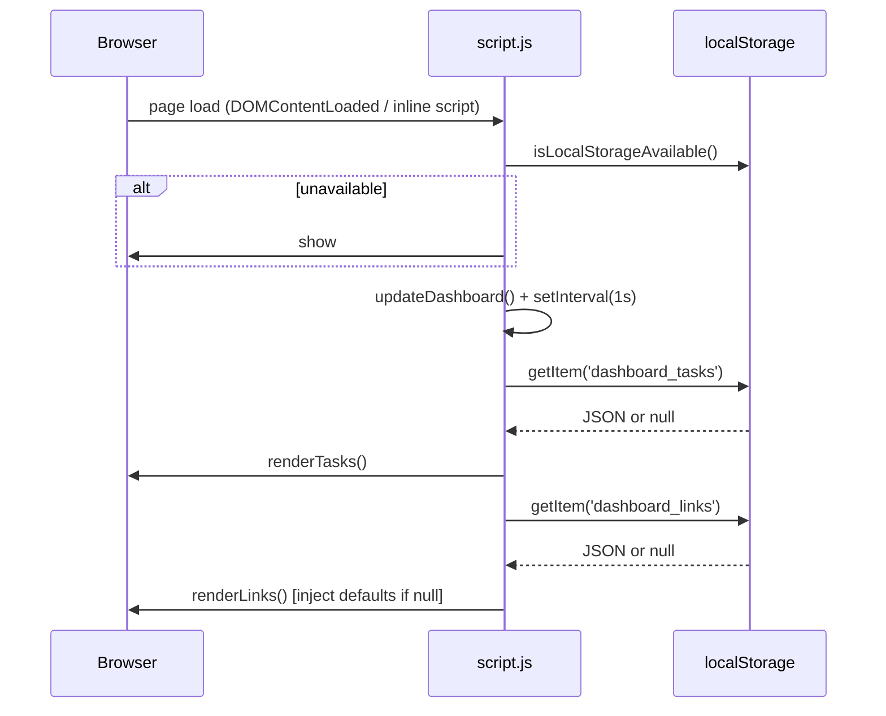

# Design Document — To-Do Life Dashboard

## Overview

The To-Do Life Dashboard is a client-side, single-page productivity application built with plain HTML, CSS, and Vanilla JavaScript. It runs entirely in the browser with no build step, no framework, and no backend server. All state is persisted in `localStorage`.

The design follows an incremental enhancement strategy: the existing codebase already provides a working skeleton for all five widgets (clock/greeting, focus timer, task list, quick links). This design document specifies the precise changes needed to close the gaps between the current implementation and the full requirements, without introducing new dependencies or architectural complexity.

**Key design goals:**
- Zero runtime dependencies — plain HTML/CSS/JS only.
- All persistence in `localStorage` under standardised keys (`dashboard_tasks`, `dashboard_links`).
- Graceful degradation when `localStorage` is unavailable.
- All widgets are self-contained functions in `js/script.js`.

---

## Architecture

The application is a single HTML page that loads one CSS file and one JavaScript file. There is no module system; all functions are global. The architecture is deliberately flat and minimal.

```
index.html
  └── css/styles.css       (all visual styling, single file)
  └── js/script.js         (all logic, single file)
       ├── Clock / Greeting module  (updateDashboard, setInterval)
       ├── Focus Timer module       (startTimer, stopTimer, resetTimer, updateTimerDisplay)
       ├── Task module              (renderTasks, addTask, toggleTask, deleteTask, editTask,
       │                             confirmEdit, cancelEdit, handleTaskKeyPress)
       ├── Quick Links module       (renderLinks, addLink, deleteLink)
       └── Storage utilities        (safeLocalStorageSet, isLocalStorageAvailable)
```

**Control flow on page load:**
1. `localStorage` availability check — shows banner if unavailable.
2. `updateDashboard()` called immediately; `setInterval` set for 1-second ticks.
3. `renderTasks()` restores tasks from `dashboard_tasks`.
4. `renderLinks()` restores links from `dashboard_links` (or injects defaults on first load).



---

## Components and Interfaces

### 1. Clock & Greeting (`updateDashboard`)

**Existing code:** functional, but greeting hour boundaries are off by one.

**Change required:**
- `h >= 5 && h < 12` → `h >= 5 && h <= 11` (equivalent; no change needed — `h < 12` already covers 5–11 correctly).
- `h >= 12 && h < 18` → `h >= 12 && h <= 17` — the current `h < 18` ends at 17:59, which is correct.
- Conclusion: greeting boundaries already match requirements. No logic change needed.

**Interface:**
```js
function updateDashboard(): void
// Called by setInterval every 1000ms and once on load.
// Reads: new Date()
// Writes: #clock.innerHTML, #date.innerHTML, #greeting.innerHTML
```

---

### 2. Focus Timer

**Existing code:** functional, but completion triggers `alert()` and then `resetTimer()`, violating Requirements 3.4 and 3.5.

**Changes required:**
- Remove `alert()` and the `resetTimer()` call at `00:00`.
- At `00:00`: stop the interval, set `isRunning = false`, retain `00:00` display, inject an inline "Session complete!" message.
- Add a `#timer-status` element in `index.html` below `#timer-display`.
- Clear `#timer-status` when `resetTimer()` or `startTimer()` is called.

**HTML addition:**
```html
<div id="timer-status" class="timer-status" aria-live="polite"></div>
```

**Interface:**
```js
function startTimer(): void
// Guard: if isRunning, return immediately (Req 3.7).
// Side effect: clears #timer-status.

function stopTimer(): void
// Guard: if !isRunning, return immediately (Req 3.8).

function resetTimer(): void
// Stops interval, resets timeLeft to 1500, calls updateTimerDisplay(), clears #timer-status.

function updateTimerDisplay(): void
// Formats timeLeft as MM:SS, writes to #timer-display.
```

---

### 3. Task Management

**Existing code:** missing edit functionality; uses wrong localStorage key.

**Changes required:**
1. Change localStorage key from `productivity_tasks` to `dashboard_tasks`.
2. Add Edit button to each task row in `renderTasks()`.
3. Implement `editTask(index)` — switches task row to edit mode (inline `<input>`).
4. Implement `confirmEdit(index)` — validates non-empty trimmed value, saves, re-renders.
5. Implement `cancelEdit(index)` — re-renders without saving.
6. Keyboard: Enter confirms, Escape cancels, within the inline edit input.
7. `renderTasks()` now also persists to `dashboard_tasks` (not `productivity_tasks`).

**Task row HTML (view mode):**
```html
<li class="task-item">
  <div class="task-left">
    <input type="checkbox" onchange="toggleTask(index)">
    <span class="task-text [completed]">text</span>
  </div>
  <div class="task-actions">
    <button class="btn-secondary btn-sm" onclick="editTask(index)">Edit</button>
    <button class="btn-danger" onclick="deleteTask(index)">Delete</button>
  </div>
</li>
```

**Task row HTML (edit mode):**
```html
<li class="task-item task-item--editing">
  <div class="task-left" style="flex:1">
    <input type="text" class="task-edit-input" value="[current text]"
           onkeydown="handleEditKeyDown(event, index)">
  </div>
  <div class="task-actions">
    <button class="btn-primary btn-sm" onclick="confirmEdit(index)">Save</button>
    <button class="btn-secondary btn-sm" onclick="cancelEdit(index)">Cancel</button>
  </div>
</li>
```

**Interface:**
```js
function editTask(index: number): void
// Sets tasks[index]._editing = true, re-renders, focuses the inline input.

function confirmEdit(index: number): void
// Reads inline input value; if trimmed is empty, do nothing (Req 4.9).
// Else: saves trimmed value, clears _editing flag, persists, re-renders.

function cancelEdit(index: number): void
// Clears _editing flag, re-renders (no save).

function handleEditKeyDown(event: KeyboardEvent, index: number): void
// Enter → confirmEdit(index); Escape → cancelEdit(index).
```

*Note: `_editing` is a transient in-memory flag on the task object. It is NOT persisted to `localStorage`.*

---

### 4. Quick Links

**Existing code:** missing length validation; uses wrong localStorage key; no error handling for localStorage failures.

**Changes required:**
1. Change localStorage key from `productivity_links` to `dashboard_links`.
2. In `addLink()`: validate `name.length <= 50` and `url.length <= 2000`; reject if over limit.
3. Wrap all `localStorage.setItem` calls in `safeLocalStorageSet()` that catches errors and shows `#storage-error`.
4. On first load (null from localStorage), inject default Google + Gmail links and save them. **Do not** save defaults on every load — only when the key is absent.

**Interface:**
```js
function addLink(): void
// Reads #link-name-input, #link-url-input.
// Validates: non-empty, name ≤50 chars, url ≤2000 chars.
// Normalises URL (prepend https:// if needed).
// Calls safeLocalStorageSet; only pushes to quickLinks array if save succeeds.

function renderLinks(): void
// Renders quickLinks array into #links-container.
// Does NOT call localStorage.setItem (only addLink/deleteLink persist).
```

---

### 5. Storage Utilities

These are new helper functions to be added at the top of `script.js`:

```js
function isLocalStorageAvailable(): boolean
// Attempts a test write/read/delete on localStorage.
// Returns true if successful, false otherwise.

function safeLocalStorageSet(key: string, value: string): boolean
// Wraps localStorage.setItem in try/catch.
// Returns true on success; on failure shows #storage-error and returns false.
```

**HTML additions needed in `index.html`:**
```html
<!-- After .dashboard-container opening tag -->
<div id="storage-warning" class="alert-banner alert-warning" hidden>
  ⚠️ Local storage is unavailable. Your data will not be saved across page reloads.
</div>
<div id="storage-error" class="alert-banner alert-error" hidden>
  ❌ Could not save to local storage. The item was not added.
</div>
```

---

## Data Models

### Task Object
```js
{
  text: string,       // Trimmed task description (non-empty)
  completed: boolean  // false = incomplete, true = done
  // _editing: boolean — transient, NOT persisted
}
```

**localStorage key:** `dashboard_tasks`  
**Format:** `JSON.stringify(Task[])`

**Example:**
```json
[
  { "text": "Buy groceries", "completed": false },
  { "text": "Read a book", "completed": true }
]
```

---

### Quick Link Object
```js
{
  name: string,  // Display label (1–50 chars)
  url: string    // Full URL with protocol (1–2000 chars)
}
```

**localStorage key:** `dashboard_links`  
**Format:** `JSON.stringify(QuickLink[])`

**Example:**
```json
[
  { "name": "Google", "url": "https://www.google.com" },
  { "name": "Gmail", "url": "https://mail.google.com" }
]
```

---

### Default Links (first-load seed)
Applied only when `localStorage.getItem('dashboard_links')` returns `null`:
```js
const DEFAULT_LINKS = [
  { name: 'Google', url: 'https://www.google.com' },
  { name: 'Gmail',  url: 'https://mail.google.com' }
];
```

---

## Correctness Properties

*A property is a characteristic or behavior that should hold true across all valid executions of a system — essentially, a formal statement about what the system should do. Properties serve as the bridge between human-readable specifications and machine-verifiable correctness guarantees.*

**Property reflection note:** Properties 1 and 2 (from the prework) were consolidated — "greeting is total" is subsumed by "greeting boundaries are correct across all 24 hours", since a function that returns the right value for every hour in 0–23 is automatically total. The final set below has no redundant properties.

---

### Property 1: Greeting covers all 24 hours with correct boundary assignment

*For any* hour value `h` in the range 0–23, the greeting logic SHALL return "Good morning!" if `h` is in [5, 11], "Good afternoon!" if `h` is in [12, 17], and "Good evening!" if `h` is in [0, 4] or [18, 23] — and SHALL never return an empty string or any other value.

**Validates: Requirements 2.1, 2.2, 2.3**

---

### Property 2: Timer display always produces correct MM:SS for any valid timeLeft

*For any* integer `timeLeft` in the range [0, 1500], calling `updateTimerDisplay()` SHALL set `#timer-display` to a string of the form `MM:SS` where the minutes and seconds are correctly computed and zero-padded.

**Validates: Requirements 3.6**

---

### Property 3: Reset returns timer to initial state from any state

*For any* timer state (any value of `timeLeft` from 0 to 1500, whether running or stopped), calling `resetTimer()` SHALL set `timeLeft` to 1500, set `isRunning` to `false`, and set `#timer-display` to `"25:00"`.

**Validates: Requirements 3.4**

---

### Property 4: Adding a valid task grows the list by exactly one

*For any* task list of arbitrary length and any non-empty, non-whitespace task description, calling `addTask` with that description SHALL increase the list length by exactly 1 and the new element SHALL have the provided trimmed text with `completed = false`.

**Validates: Requirements 4.1**

---

### Property 5: Whitespace-only input is rejected and list is unchanged

*For any* task list state and any string composed entirely of whitespace characters (including the empty string), calling `addTask` with that input SHALL leave the task list identical in length and content to its state before the call.

**Validates: Requirements 4.2**

---

### Property 6: Task persistence round-trip

*For any* task list produced by any sequence of add, toggle, edit, and delete operations, serialising the array to `dashboard_tasks` via `JSON.stringify` and then deserialising it via `JSON.parse` SHALL produce a task list that is deeply equal to the original (same order, same `text`, same `completed` values).

**Validates: Requirements 4.7, 4.8, 6.3**

---

### Property 7: Edit with non-empty value updates text; edit with whitespace value is rejected

*For any* task with any existing text:
- *For any* non-empty, non-whitespace replacement string, confirming an edit SHALL update the task's `text` to the trimmed replacement and leave `completed` unchanged.
- *For any* string composed entirely of whitespace, confirming an edit SHALL leave the task's `text` and `completed` state identical to their pre-edit values.

**Validates: Requirements 4.6, 4.9**

---

### Property 8: URL normalisation is idempotent

*For any* URL string, applying the `https://` prepend normalisation rule twice SHALL produce the same result as applying it once — a URL already starting with `http://` or `https://` SHALL NOT have `https://` prepended again.

**Validates: Requirements 5.3**

---

### Property 9: Quick link length validation rejects over-limit inputs, and valid inputs are persisted

*For any* link name exceeding 50 characters OR any URL exceeding 2000 characters, calling `addLink` SHALL not append any new item to the `quickLinks` array. Conversely, *for any* valid name (1–50 chars) and valid URL (1–2000 chars), the item SHALL be appended and the resulting array serialised to `dashboard_links` and deserialised SHALL be deeply equal to the in-memory array.

**Validates: Requirements 5.1, 5.2, 5.6, 5.7, 6.3**

---

## Error Handling

### localStorage Unavailability

**Detection:** On page load, `isLocalStorageAvailable()` attempts a write/read/delete cycle. If it throws or returns an incorrect value, the function returns `false`.

**Response:**
- Show `#storage-warning` banner (persistent, non-dismissible).
- All `localStorage.setItem` calls are skipped.
- Application runs in session-only mode: all data lives in JS variables and is lost on reload.
- No crash; no unhandled exceptions.

### localStorage Write Failure (quota exceeded, etc.)

**Detection:** `safeLocalStorageSet()` wraps `localStorage.setItem` in a `try/catch`.

**Response (Quick Links):**
- Show `#storage-error` banner briefly (auto-hide after 4 seconds, or persistent — designer's choice).
- The item is NOT pushed to the in-memory array.
- The `links-container` is NOT re-rendered with the new item.

**Response (Tasks):**
- Tasks are persisted on every render. If a write fails, the in-memory array is still updated (the task is added to the list in the session), but a non-fatal warning is shown.

### Invalid JSON in localStorage

**Detection:** `JSON.parse()` call on load may throw if data is corrupted.

**Response:**
- Wrap in `try/catch`; fall back to an empty array `[]` for tasks and `DEFAULT_LINKS` for links.
- No visible error (silent recovery).

### Timer Edge Cases

- **Duplicate Start:** Guarded by `if (isRunning) return`.
- **Stop when already stopped:** Guarded by `if (!isRunning) return` (or simply calling `clearInterval` on a cleared/undefined interval, which is a no-op).
- **Reset while running:** `clearInterval(timer)` then reset — always safe.

---

## Testing Strategy

### Unit Tests (Example-Based)

These cover specific behaviors with concrete inputs:

| Test | Requirement |
|---|---|
| `updateDashboard()` sets `#clock` to `HH:MM:SS` | 1.1 |
| Clock shows `08:05:03` for 8h 5m 3s | 1.1 |
| Greeting = "Good morning!" at 5:00, 11:59 | 2.1 |
| Greeting = "Good afternoon!" at 12:00, 17:59 | 2.2 |
| Greeting = "Good evening!" at 18:00, 23:59, 0:00, 4:59 | 2.3 |
| Timer starts at `25:00` | 3.1 |
| Timer at `00:01` ticks to `00:00` and stops | 3.5 |
| Timer shows "Session complete!" at completion | 3.5 |
| `resetTimer()` restores `25:00` and clears status | 3.4 |
| `addTask("")` → list unchanged | 4.2 |
| `addTask("  ")` → list unchanged | 4.2 |
| `addTask("Buy milk")` → list grows by 1 | 4.1 |
| `toggleTask(0)` flips `completed` | 4.3 |
| `deleteTask(0)` removes item | 4.5 |
| `confirmEdit(0, "")` → text unchanged | 4.9 |
| `addLink("X", "google.com")` → URL becomes `https://google.com` | 5.3 |
| `addLink` with name.length = 51 → rejected | 5.2 |
| `addLink` with url.length = 2001 → rejected | 5.2 |
| First load with no saved links → Google + Gmail shown | 5.8 |

### Property-Based Tests

The project uses pure JavaScript functions that are well-suited for property-based testing. The recommended library is **[fast-check](https://fast-check.dev/)** (Node-compatible, no framework required).

Each test runs a minimum of **100 iterations**.

| Property | Tag |
|---|---|
| Greeting covers all 24 hours with correct boundary assignment | `Feature: todo-life-dashboard, Property 1: Greeting covers all 24 hours with correct boundary assignment` |
| Timer display produces correct MM:SS for any valid timeLeft | `Feature: todo-life-dashboard, Property 2: Timer display always produces correct MM:SS for any valid timeLeft` |
| Reset returns timer to initial state from any state | `Feature: todo-life-dashboard, Property 3: Reset returns timer to initial state from any state` |
| Adding valid task grows list by 1 | `Feature: todo-life-dashboard, Property 4: Adding a valid task grows the list by exactly one` |
| Whitespace input rejected, list unchanged | `Feature: todo-life-dashboard, Property 5: Whitespace-only input is rejected and list is unchanged` |
| Task persistence round-trip | `Feature: todo-life-dashboard, Property 6: Task persistence round-trip` |
| Edit with non-empty value updates text; edit with whitespace rejected | `Feature: todo-life-dashboard, Property 7: Edit with non-empty value updates text; edit with whitespace value is rejected` |
| URL normalisation is idempotent | `Feature: todo-life-dashboard, Property 8: URL normalisation is idempotent` |
| Quick link length validation and persistence round-trip | `Feature: todo-life-dashboard, Property 9: Quick link length validation rejects over-limit inputs, and valid inputs are persisted` |

### Integration / Smoke Tests

These verify the wiring of the full page rather than isolated functions:

| Test | Requirement |
|---|---|
| Page loads without JS errors in Chrome/Firefox/Edge/Safari | 6.2 |
| `#clock` updates every second (observe 2 ticks) | 1.3 |
| All four cards are visible at 320px viewport | 7.1 |
| Input group stacks vertically below 480px | 7.3 |
| Input group is horizontal at 480px+ | 7.4 |
| `localStorage` blocked → `#storage-warning` visible | 6.4 |
| Default links present on first load (cleared storage) | 5.8 |

### Responsive Layout Testing

Manual checks at breakpoints: 320px, 375px, 480px, 768px, 1280px, 1920px using browser DevTools. No horizontal scrollbar should appear at any of these widths.
